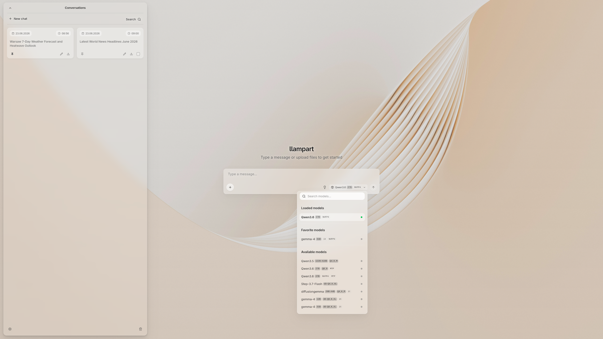
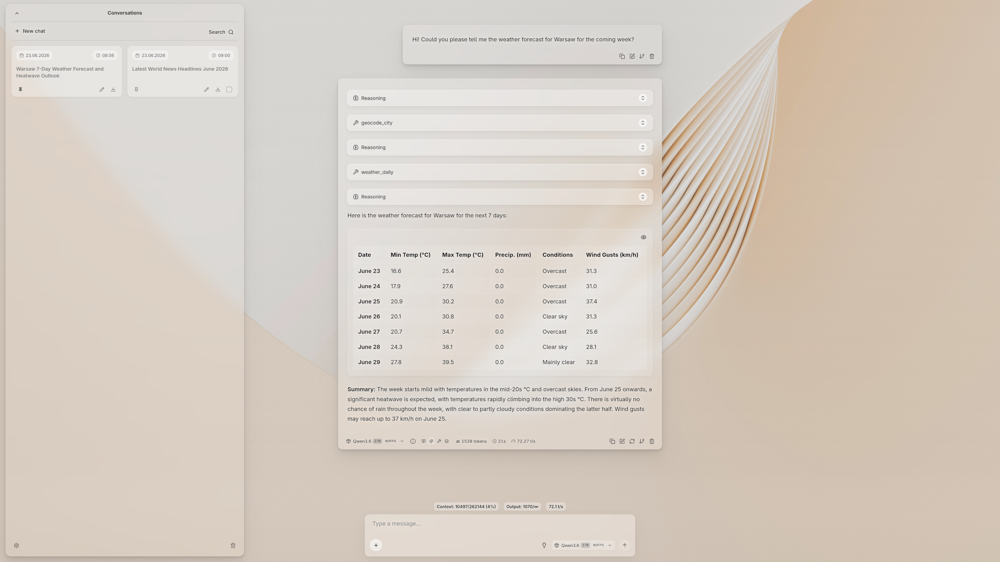
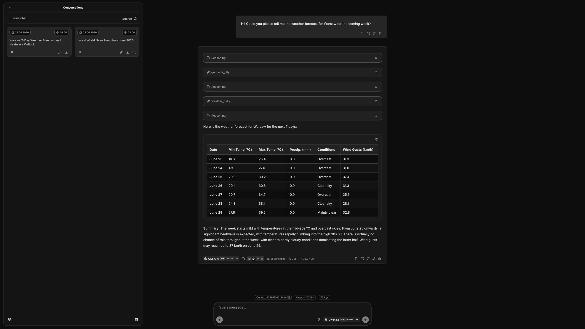
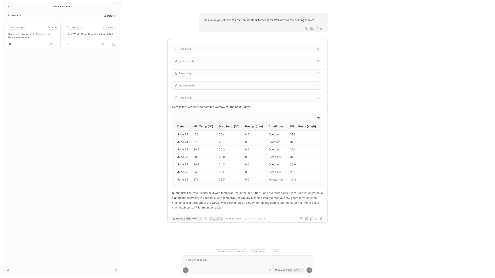
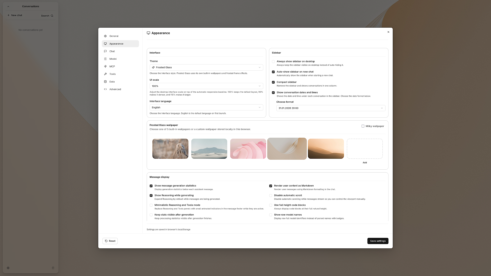

# llampart

llampart is a local chat Web UI designed for use with `llama-server` and `OpenAI-compatible`.

The project focuses on a polished desktop experience, including a custom Frosted Glass theme, conversation management, model selection, MCP-related UI flows, and careful local settings handling.

## Project status

llampart is being prepared as an open-source project.

Current release:

```text
llampart 1.6.3
```

## Features

llampart builds on the llama.cpp / llama-ui foundation and focuses on a more polished, desktop-oriented local chat experience.

Key llampart features include:

- **Frosted Glass visual theme**
  A custom translucent interface style with wallpaper-backed surfaces, blur, softened panels, redesigned menus, bundled/custom wallpapers, and readability controls.

- **Desktop-oriented conversation sidebar**
  A redesigned sidebar with tiled conversations, adaptive one- or two-column layout, optional compact mode, pinned conversations, date/time display, and direct conversation management.

- **Interface scaling and appearance settings**
  Local controls for UI scale, visual theme, sidebar layout, message/statistics display behavior, model display preferences, and generation-related chat parameters.

- **Localized interface**
  Interface translations for multiple languages, including English, Polish, German, French, Italian, and Spanish, with user-facing settings and chat labels following the selected language.

- **Minimalistic Reasoning and Tools display**
  Optional cleaner presentation for reasoning and tool-related assistant activity, including inline status indicators while the assistant is thinking or using tools.

- **Local import/export flows**
  Local import/export workflows for settings and conversations, with settings export designed to avoid sensitive local configuration by default.

- **Provider-aware backend support**
  Support for both `llama-server` and `OpenAI-compatible` API servers, with provider-specific connection settings, model actions, chat request behavior, and advanced settings.

- **MCP prompts, resources, and server-related UI flows**
  MCP prompt/resource workflows and server-related UI flows integrated into the customized llampart chat interface.

- **Linux Installer**
  A bundled Linux installer for deploying prebuilt llampart release assets, serving them through Caddy, and supporting installation, update, status, and maintenance flows.

## Screenshots

### Frosted Glass start screen



### Frosted Glass chat



### Dark and light themes





### Appearance settings



## Installation

llampart can be installed on supported Linux systems with the bundled installer. The installer deploys the prebuilt llampart Web UI, serves it through Caddy, configures Caddy autostart, and keeps the backend/model server separate. It does not install `llama-server`, Ollama, LM Studio, models, Node.js, npm dependencies, or development tooling.

Supported installer targets are Ubuntu-based and Arch Linux-based distributions with systemd.

```bash
curl -fsSL https://raw.githubusercontent.com/mchowy-troll/llampart/main/install.sh | bash
```

Full installation, update, configuration, uninstall, file layout, and troubleshooting documentation is available in [the Linux installation guide](docs/installation/linux-caddy.md).

## Requirements

For normal installed use:

- a supported Linux distribution for the installer: Ubuntu-based or Arch Linux-based
- systemd
- Caddy
- a separately running backend, such as `llama-server` or an `OpenAI-compatible` API server

For Web UI development:

- Node.js 20 or newer
- npm
- git

## Development

From the repository root:

```bash
cd server/webui
npm install
npm run dev
```

Common validation commands:

```bash
cd server/webui
npm run check
npm run lint
npm run build
```

The production Web UI build is generated into `server/public`.

Release Web UI assets for the installer are packaged from an already-built `server/public` directory with:

```bash
cd server/webui
bash scripts/package-release-llampart.sh
```

## Repository layout

```text
server/
├── public/      # generated frontend build consumed by the server and release packager
└── webui/       # SvelteKit Web UI source, tests, docs, and helper scripts
```

The main frontend project lives in:

```text
server/webui
```

The root installer lives at:

```text
install.sh
```

## Relationship to llama.cpp

llampart is based in part on the `llama-ui` work from the `llama.cpp` project and is designed to work with `llama-server` as a local backend.

`llama.cpp` and `llama-server` are separate upstream projects. `OpenAI-compatible` API servers are also separate projects. llampart is not an official llama.cpp project.

See:

- `NOTICE`
- `THIRD_PARTY_LICENSES.md`

for attribution and third-party license information.

## Frontend framework

llampart's frontend is built with Svelte and SvelteKit.

Svelte and SvelteKit are MIT-licensed open-source projects. Their license information is preserved through npm package metadata, installed package license files, and the project third-party license notes.

## Credits

llampart is developed by Marcin Gluziński.

Special thanks to Marcin Stefański (Gdańsk, Poland) and to the Unsplash photographers whose photos are used as bundled Frosted Glass wallpapers. Full project and bundled asset credits are maintained in `AUTHORS.md`.

llampart includes and adapts work from the `llama.cpp` / `llama-ui` foundation. See `AUTHORS.md`, `NOTICE` and `THIRD_PARTY_LICENSES.md` for details.

## License

llampart is released under the MIT License. See `LICENSE`.

Third-party notices and license information are provided in `NOTICE` and `THIRD_PARTY_LICENSES.md`.

This license information is provided for open-source project hygiene and is not legal advice.
