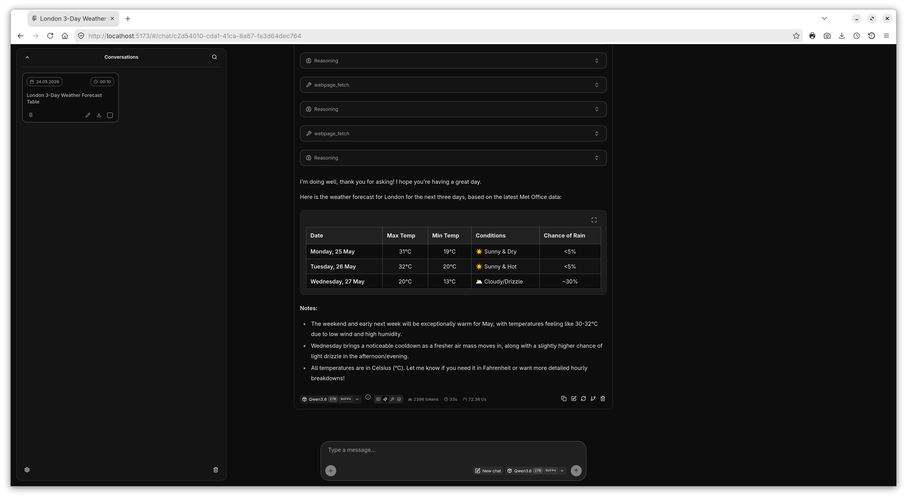
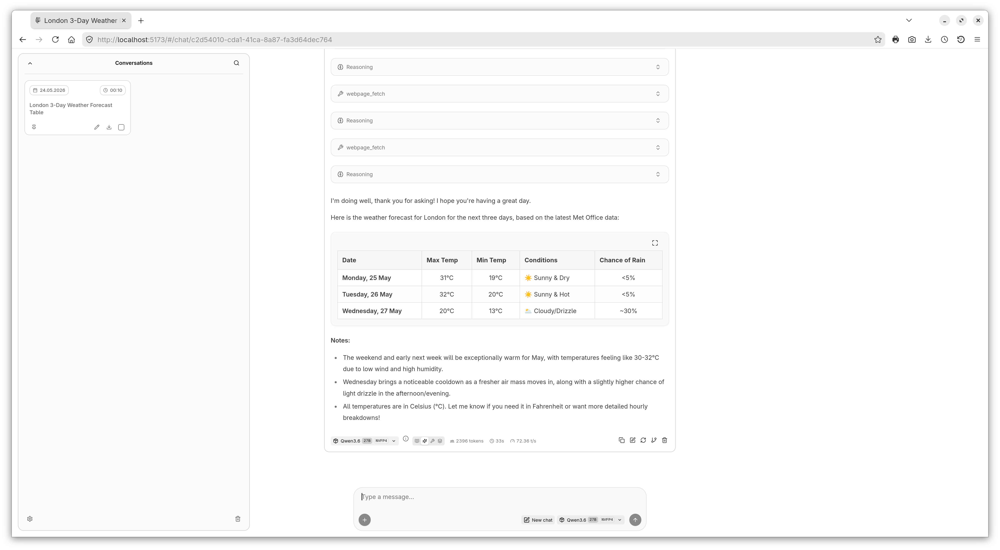

<!-- llampart-readme-logo:start -->
<p align="center">
  
</p>
<!-- llampart-readme-logo:end -->

# llampart

llampart is a local-first chat Web UI designed for use with `llama-server`.

The project focuses on a polished desktop experience, including a custom Frosted Glass theme, conversation management, model selection, MCP-related UI flows, and careful local settings handling.

## Project status

llampart is being prepared as an open-source project.

Current release:

```text
llampart 1.0.1
```

<!-- llampart-readme-screenshots:start -->

## Screenshots

### Frosted Glass start screen


### Frosted Glass chat


### Dark and light themes





### Appearance settings


<!-- llampart-readme-screenshots:end -->

## Relationship to llama.cpp

llampart is based in part on the `llama-ui` work from the `llama.cpp` project and is designed to work with `llama-server` as its local backend.

`llama.cpp` and `llama-server` are separate upstream projects. llampart is not an official llama.cpp project.

See:

- `NOTICE`
- `THIRD_PARTY_LICENSES.md`

for attribution and third-party license information.

## Features

llampart builds on the llama.cpp / llama-ui foundation and focuses on a more polished, desktop-oriented local chat experience.

Key llampart features include:

- **Frosted Glass visual theme**
  A custom translucent interface style with wallpaper-backed surfaces, blur, softened panels, redesigned menus, and tuned contrast for everyday desktop use.

- **Wallpaper customization for Frosted Glass**
  Support for bundled wallpapers and a user-selected custom wallpaper. The Frosted Glass wallpaper system also includes a milkiness/readability mode that softens the background and improves text legibility.

- **Two-column tiled conversation sidebar**
  A redesigned conversation sidebar with a tiled layout that can use two columns on wider desktop viewports and adapts to a single-column layout when space is limited.

- **Conversation organization tools**
  Conversations can show their date and time, be pinned for quick access, and be managed directly from the sidebar. llampart also supports selective conversation deletion and a one-click “delete all conversations” flow that preserves pinned conversations.

- **Localized interface**
  llampart includes interface translations for multiple languages, including English, Polish, German, French, Italian, and Spanish. User-facing settings and chat UI labels are designed to follow the selected interface language.

- **Minimalistic Reasoning and Tools display**
  Optional cleaner presentation for reasoning and tool-related assistant sections, designed to reduce visual noise while keeping reasoning/tool information accessible when needed.

- **Extended chat and interface settings**
  llampart includes additional local-first settings for the chat experience, including visual theme selection, Frosted Glass wallpaper options, conversation date/time display, message/statistics display behavior, model display preferences, and generation-related chat parameters.

- **Local import/export flows for settings and conversations**
  llampart provides local import/export workflows. Settings export is designed to avoid including sensitive local configuration by default, such as API keys, server connection URLs, and MCP server definitions.

- **Local llama-server connection workflow**
  llampart is designed to work with `llama-server`. When the server URL setting is left empty, llampart uses the current origin; in the typical local setup this connects through `llama-server` on port `8080`.

- **MCP prompts, resources, and server-related UI flows**
  llampart keeps MCP prompt/resource workflows and server-related UI flows available while integrating them into the customized llampart chat interface.

## Repository layout

```text
server/
├── public/      # generated frontend build consumed by the server
└── webui/       # SvelteKit Web UI source, tests, docs, and helper scripts
```

The main frontend project lives in:

```text
server/webui
```

## Requirements

For Web UI development:

- Node.js 20 or newer
- npm
- git

For real local chat usage, start `llama-server` separately and point llampart to it as needed.

## Development

From the repository root:

```bash
cd server/webui
npm install
npm run dev
```

Common validation commands:

```bash
cd server/webui
npm run check
npm run lint
npm run build
```

The production Web UI build is generated into `server/public`.

<!-- llampart-readme-caddy-deployment:start -->

<!-- llampart-readme-frontend-framework:start -->

## Frontend framework

llampart's frontend is built with Svelte and SvelteKit.

Svelte and SvelteKit are MIT-licensed open-source projects. Their license information is preserved through npm package metadata, installed package license files, and the project third-party license notes.

<!-- llampart-readme-frontend-framework:end -->

## Optional Caddy deployment

llampart can also be served as a static frontend through Caddy, with selected API requests proxied to a local `llama-server`.

See [Deploying llampart with Caddy](docs/deployment/caddy.md) for a practical local/LAN deployment example.

<!-- llampart-readme-caddy-deployment:end -->

## Wallpapers

llampart supports a Frosted Glass wallpaper workflow:

- five bundled/default wallpaper slots
- one user-selected custom wallpaper option

The bundled Frosted Glass wallpaper files are part of the public release asset set. Wallpaper photo credits are shown in llampart's About / Welcome dialog and preserved in NOTICE.

Wallpaper photos used by the program are credited in the application and project notices.

## Credits

llampart is developed by Marcin Gluziński.

Special thanks to Marcin Stefański (Gdańsk, Poland) and to the Unsplash photographers whose photos are used as bundled Frosted Glass wallpapers.

llampart includes and adapts work from the `llama.cpp` / `llama-ui` foundation. See `NOTICE` and `THIRD_PARTY_LICENSES.md` for details.

## License

llampart is released under the MIT License. See `LICENSE`.

Third-party notices and license information are provided in `NOTICE` and `THIRD_PARTY_LICENSES.md`.

This license information is provided for open-source project hygiene and is not legal advice.
